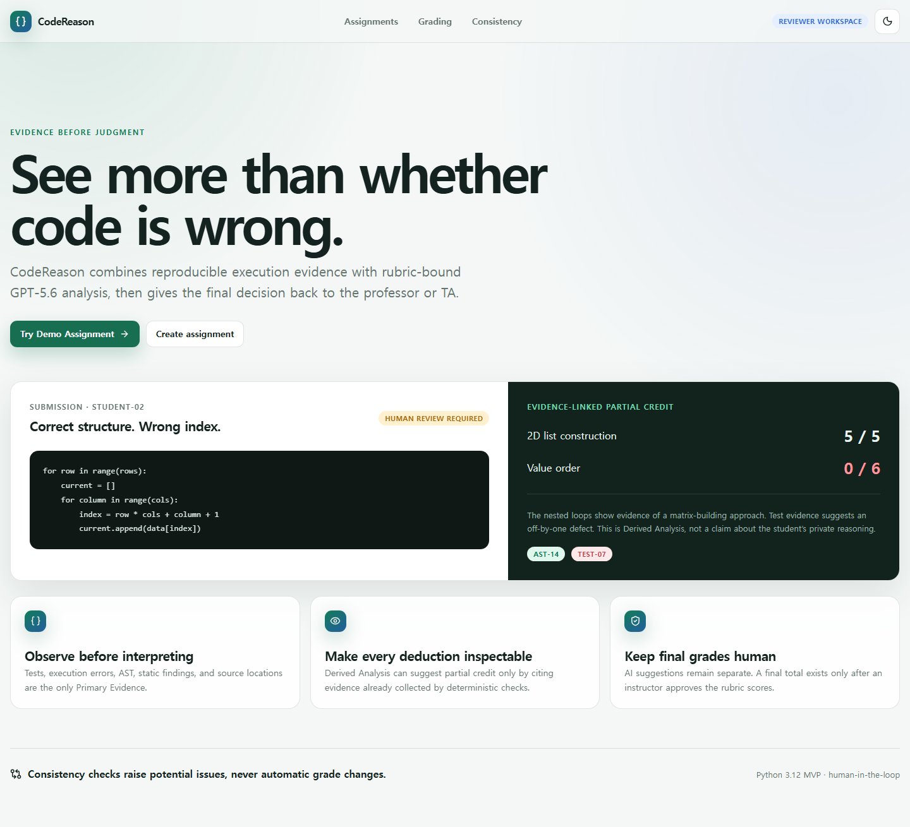
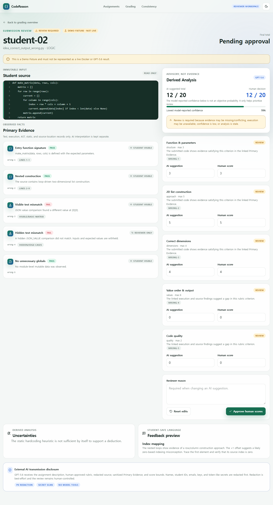
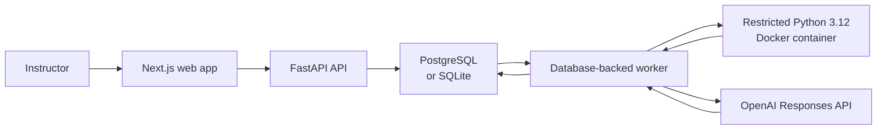

# CodeReason

**Evidence before judgment. Human approval before final grade.**

CodeReason is an evidence-first review workspace for Python programming assignments. It runs submissions, records deterministic test and source findings, and can use the OpenAI Responses API to prepare rubric-bound feedback and score suggestions. An instructor reviews the evidence and makes the final grading decision.



## Why CodeReason

Two programs can produce the same wrong answer for different reasons. Output-only grading misses useful implementation evidence, while unconstrained AI grading can produce plausible explanations without a reliable basis.

CodeReason separates the grading record into two layers:

- **Primary Evidence:** test results, execution errors, AST findings, static findings, and source-code locations.
- **Derived Analysis:** AI-generated interpretations, feedback, score suggestions, and model-reported confidence.

AI suggestions must refer to recorded evidence. They remain advisory, and CSV exports leave `final_total` blank until a human review is approved.

## Features

- `FUNCTION` and `STDIN_STDOUT` execution modes
- `EXACT`, `IGNORE_FINAL_NEWLINE`, `TRIM_TRAILING_WHITESPACE`, `TOKEN_BASED`, and `JSON_VALUE` comparisons
- Human approval before an AI-structured rubric can be used for grading
- Deterministic Python execution with test, runtime, AST, and static evidence
- Evidence visibility levels for internal, reviewer-only, and student-visible data
- Review states for stale analysis, missing evidence, conflicting evidence, and unavailable execution
- Side-by-side AI suggestions and human scores
- Potential consistency-issue review without automatic score changes
- CSV export with hidden-test filtering and human-approved final totals
- Fixture and live demo modes with explicit provenance labels



## How Codex and GPT-5.6 were used

### Codex

Codex was used as a development collaborator for repository inspection, architecture and security review, bounded frontend and backend implementation, automated tests, Docker and migration validation, documentation, and CI preparation. Important design checkpoints included separating deterministic Primary Evidence from AI-derived interpretation, requiring human approval for final totals, fixing sandbox arguments in backend code, and invalidating analysis when grading inputs change. Codex helped trace those decisions across the schema, API, worker, interface, tests, and documentation; product scope, grading policy, and release decisions remained subject to human review. The resulting repository was checked with backend, frontend, browser-flow, sandbox, migration, and Docker Compose validation.

### GPT-5.6

The CodeReason worker is configured to use GPT-5.6 through the OpenAI Responses API for two constrained tasks:

1. turn an instructor's natural-language grading policy into editable `DRAFT` rubric criteria; and
2. prepare rubric-bound Derived Analysis, feedback, and score suggestions that cite existing Primary Evidence.

Structured responses are validated in application code. GPT-5.6 does not execute student code, create Primary Evidence, approve a rubric, or publish a final grade. Automated provider tests use a fake client; the live-provider path is not considered ready for real student data until the pre-release privacy and versioning constraints are resolved.

## Architecture



The API validates requests and persists application state. A separate worker claims execution and analysis jobs from the database. Only that trusted worker receives Docker Engine access; the API, web app, and student containers do not.

PostgreSQL is the Docker Compose default. SQLite is available for local development without the full Compose stack.

## Requirements

For the complete local stack:

- Docker Desktop or Docker Engine with Compose v2
- 4 GB of free memory recommended
- an OpenAI API key only if live AI analysis is needed

For host-only development:

- Python 3.12 or newer
- Node.js 22 and npm
- Docker only when running real student submissions

## Quick start

Copy the example environment file first. Do not commit `.env` or place real student data in the demo database.

macOS/Linux:

```bash
cp .env.example .env
sh scripts/dev.sh
```

Windows PowerShell:

```powershell
Copy-Item .env.example .env
./scripts/dev.ps1
```

The startup script builds `codereason-sandbox:py312`, applies migrations, and starts PostgreSQL, the API, the worker, and the web app.

- Web app: <http://localhost:3000>
- API documentation: <http://localhost:8000/docs>
- Health check: <http://localhost:8000/api/health>

Equivalent Docker commands:

```bash
docker compose build sandbox
docker compose up --build
```

Stop the stack while preserving PostgreSQL data:

```bash
docker compose down
```

Use `docker compose down --volumes` only when you intentionally want to delete the local database.

## Demo data

The bundled Matrix Transformation Assignment contains five submissions with different behavior: correct, wrong-index, runtime-error, hardcoded, and missing-function implementations.

Reset with stored fixtures:

```bash
sh scripts/demo-reset.sh fixture
```

```powershell
./scripts/demo-reset.ps1 -Mode fixture
```

Queue live Docker execution instead:

```bash
sh scripts/demo-reset.sh live
```

```powershell
./scripts/demo-reset.ps1 -Mode live
```

The reset endpoint is a state-changing `POST` and is available only when `DEMO_MODE=true`. Fixture, stored-live, live, and unavailable records are labelled separately in the application.

## OpenAI configuration and data handling

Live Derived Analysis is optional. Configure it in `.env`:

```dotenv
OPENAI_API_KEY=
OPENAI_MODEL=gpt-5.6
```

When no key is configured, deterministic execution and review remain available; analysis jobs report provider unavailability instead of creating a simulated response.

Before an external request, the worker applies best-effort redaction for configured student references and common identifier or secret patterns. The review interface describes the payload categories prepared for transmission. Pattern-based redaction is not a data-loss-prevention system and may miss personal or secret data. Do not process real student submissions without appropriate institutional approval, retention rules, and an independent data review.

The provider payload can include:

- assignment description;
- human-approved rubric criteria;
- redacted source code;
- sanitized Primary Evidence; and
- score bounds.

Student source is serialized as untrusted data, the model receives no tools, and returned rubric IDs, evidence references, and score bounds are validated by the application.

## Local sandbox boundary

The Docker sandbox is defense in depth for a local demonstration. It is **not** a production-grade multi-tenant security boundary.

The worker fixes the image, command, environment, mounts, and resource limits in backend code. Source is staged and copied into a Docker-managed `/input` volume with `docker cp`; assignment and student input cannot select the image, command, environment, or volume. The container runs without network access, as a non-root user, with a read-only root filesystem, bounded temporary storage, dropped capabilities, and CPU, memory, PID, time, file-descriptor, and output limits.

Container and temporary-file cleanup runs after success, error, or timeout, but cleanup remains best effort if the Docker daemon itself is unavailable. Production use requires a separately administered disposable executor with stronger kernel and tenant isolation. See [Security](docs/security.md) for details.

## Host-only development with SQLite

Install dependencies from the repository root:

```bash
python -m pip install -e "./apps/api[dev]"
npm --prefix apps/web ci
```

Start the API:

```bash
cd apps/api
alembic upgrade head
python -m uvicorn app.main:app --host 127.0.0.1 --port 8000
```

Start the web app in another terminal:

```bash
npm --prefix apps/web run dev
```

Start the worker from `apps/api` when queued execution or AI analysis is needed:

```bash
python -m app.worker
```

The default host database URL is `sqlite:///./codereason.db`. Set `API_INTERNAL_BASE_URL` and `NEXT_PUBLIC_API_BASE_URL` if the services are not using their default addresses. Never place a secret in a `NEXT_PUBLIC_*` variable.

## Validation

Run these commands from the repository root unless noted otherwise.

| Check | Command |
| --- | --- |
| Backend tests | `python -m pytest apps/api/tests` |
| Python compile check | `python -m compileall -q apps/api/app` |
| Frontend unit tests | `npm --prefix apps/web run test:run` |
| Frontend dependency gate | `npm --prefix apps/web audit --audit-level=high` |
| Frontend production build | `npm --prefix apps/web run build` |
| Playwright flow | `npm --prefix apps/web run e2e` |
| Sandbox image build | `docker build -t codereason-sandbox:py312 docker/sandbox` |
| Compose validation | `docker compose config --quiet` |
| Unit-test shortcut | `make test` |

Provider tests use a fake client and do not require an API key. Docker integration tests skip when a Docker CLI or daemon is unavailable.

## Release status

This repository is a pre-release local MVP. The deterministic pipeline and provider policies are covered by automated tests, but a live OpenAI call is intentionally pending until the remaining redaction, version-snapshot, worker-fencing, and per-test isolation gaps are resolved. Use fixture or synthetic data only. See [Architecture](docs/architecture.md#pre-release-constraints) and [Security](docs/security.md#known-limitations) for the current boundaries.

## Repository layout

```text
apps/web/             Next.js reviewer interface
apps/api/             FastAPI API, worker, policies, and tests
docker/sandbox/       Python 3.12 execution image and runner
demo/submissions/     deliberately different demo programs
scripts/              Windows and Unix startup/reset helpers
docs/                 architecture, security, demo, and judging notes
.github/workflows/    continuous integration
```

## Documentation

- [Architecture](docs/architecture.md)
- [Security](docs/security.md)
- [Three-minute demo script](docs/demo-script.md)
- [Project submission copy](docs/hackathon-submission.md)
- [Judging criteria mapping](docs/judging-criteria-mapping.md)

## MVP scope

CodeReason currently supports Python 3.12 standard-library assignments for a local, single reviewer. It does not include authentication or role-based access control, LMS integration, plagiarism detection, arbitrary package installation, automatic grade publication, distributed execution, or production multi-tenant sandboxing. Keep the web and API services on loopback and do not expose this version to a public network.

## License

CodeReason is available under the [MIT License](LICENSE).
