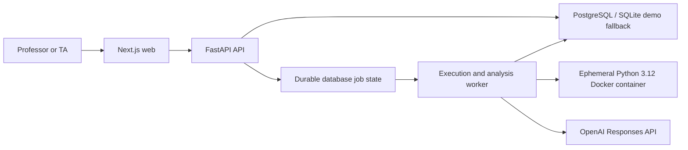

# CodeReason architecture

CodeReason is an evidence-first, human-in-the-loop grading assistant for Python assignments. It separates observed facts from model interpretation and never promotes an unapproved AI score to a final grade.

## Service layout

The API validates requests, persists immutable inputs, and enqueues work. A separate worker owns Docker control and AI calls. Student code never runs inside the API process. The MVP uses a single database-backed worker rather than Redis or a distributed queue.

Public orchestration routes create pending jobs; they do not accept client-authored execution results as authoritative. Worker-owned compatibility writes are hidden from OpenAPI and can be guarded with `INTERNAL_WORKER_TOKEN`. In the shipped worker, deterministic results and provider outputs are persisted through a trusted database session.

The deployment target is one reviewer on one local machine. There is no end-user authentication, authorization, or tenant boundary, and the Compose ports are intentionally bound to loopback. This architecture must not be exposed as a network service without adding those controls.

## Responsible-grading invariants

1. Primary Evidence is limited to test results, execution errors, AST findings, static findings, and source-code locations. AI output remains Derived Analysis.
2. Analysis describes observable code and behavior with cautious language; it never claims to know a student's private thought process.
3. The explicit student reference plus labelled English/Korean names, pattern-detectable IDs, emails, and supported secret formats are redacted before an external provider call, and the UI discloses transmitted data categories. Detection remains best effort.
4. Docker is local defense in depth, not a production security boundary. Image, command, environment, and lifecycle arguments are backend-owned, and cleanup is attempted with bounded retries on every exit path.
5. Source is copied with `docker cp` into `/input` on a stopped container. `/input` is a backend-fixed Docker-managed anonymous volume, not a host bind mount; assignment and student input cannot construct or configure it. Cleanup uses `docker rm --force --volumes` so successful container removal also removes the anonymous input volume.
6. Every assignment records `execution_mode`, `entry_function`, `arguments_schema`, and `comparison_mode`, with separate `FUNCTION` and `STDIN_STDOUT` harnesses.
7. Each test records the policy actually used: `EXACT`, `IGNORE_FINAL_NEWLINE`, `TRIM_TRAILING_WHITESPACE`, `TOKEN_BASED`, or `JSON_VALUE`.
8. Partial-credit suggestions combine tests, runtime behavior, AST/static observations, and rubric rules; AST shape alone is not proof of understanding.
9. Evidence visibility is `INTERNAL`, `REVIEWER_ONLY`, or `STUDENT_VISIBLE`; hidden inputs and expected outputs are excluded from student feedback and CSV.
10. `model_reported_confidence` is not a calibrated probability. It only helps prioritize review, alongside missing evidence, execution unavailability, and conservatively derived conflicting deterministic observations.
11. Source, rubric, or test changes make dependent analysis `STALE`, return an approved submission to `REVIEW_REQUIRED`, and retain old HumanReview entries as audit history.
12. Consistency fingerprints include test-status vector, error category, AST feature summary, exception type, and signature status. A match raises only a potential issue.
13. CSV `final_total` is blank until a current HumanReview approves the grade.
14. New or AI-structured rubric criteria remain `DRAFT` and cannot grade until a person changes them to `HUMAN_APPROVED`.

## Evidence taxonomy

Primary Evidence is restricted to observed or reproducibly derived facts:

- `TestResult`
- `ExecutionError`
- `ASTFinding`
- `StaticFinding`
- `SourceCodeLocation`

AI interpretations, score suggestions, feedback, and `model_reported_confidence` are Derived Analysis. They may cite Primary Evidence IDs but cannot create new facts or act as evidence for their own deductions.

Every evidence record has one visibility level:

- `INTERNAL`: operational details not shown outside the service
- `REVIEWER_ONLY`: available to instructors, including hidden-test details
- `STUDENT_VISIBLE`: safe for student-facing feedback and export summaries

Hidden test inputs, expected outputs, and reviewer-only evidence are omitted from student feedback and CSV exports.

## Core relationships

- An `Assignment` owns rubric items, test cases, and submissions.
- A `RubricCriterion` must be `HUMAN_APPROVED` before it can be used for grading.
- A `Submission` owns immutable source files and versioned execution, AI analysis, and human review records.
- An `ExecutionRun` owns test results and Primary Evidence.
- An `AIAnalysis` owns Derived Analysis and rubric score suggestions.
- A `HumanReview` preserves an auditable decision and owns the approved rubric scores used to calculate `final_total`; a later review only makes the prior row non-current.
- `ConsistencyIssue` records a potential issue; it never changes a score.

## Execution contract

Assignments explicitly define:

- `execution_mode`: `FUNCTION` or `STDIN_STDOUT`
- `entry_function`: required for `FUNCTION`
- `arguments_schema`: JSON Schema for function arguments or stdin case data
- `comparison_mode`: default output comparison policy

Each test result records the policy actually applied: `EXACT`, `IGNORE_FINAL_NEWLINE`, `TRIM_TRAILING_WHITESPACE`, `TOKEN_BASED`, or `JSON_VALUE`.

New and AI-structured rubric criteria are stored as `DRAFT`. Only an explicit human approval transition makes a criterion eligible for grading. The bundled fixture assignment is pre-seeded with human-origin, human-approved criteria so the review demo is immediately usable.

## Versioning and stale analysis

Source code, rubric, or test case changes increment the relevant content revision. Any analysis based on an older revision becomes `STALE`. If an approved submission's inputs change, its state returns to `REVIEW_REQUIRED`; prior review decisions and scores remain preserved as non-current audit history and are not reused as current grades.

Deleting a rubric criterion or test case that is already referenced by audit data deactivates it instead of deleting the row. Current reviewer and CSV projections ignore stale analysis feedback, while historical records remain available for audit.

This is not yet a complete immutable audit snapshot. `TestResult` and human score rows reference mutable test and rubric definitions, and asynchronous workers do not yet fence every concurrent input change. Until versioned definition snapshots and worker leases are implemented, historical rendering and in-flight updates require reviewer verification.

## AI boundary

Before an external AI call, CodeReason creates a redacted transmission payload. It removes detected names, student IDs, email addresses, API keys, bearer tokens, and common secret formats. The UI shows which categories of data will be transmitted. The model receives only the assignment description, approved rubric, redacted code, sanitized primary evidence, and score bounds.

Model language must describe what the code *shows evidence of*, what a pattern *suggests*, or a *likely misconception*. It must not claim access to a student's internal reasoning or intent.

Structured output is validated again in application code. Unknown rubric IDs, nonexistent evidence IDs, unsupported deductions, out-of-range scores, or malformed results force `REVIEW_REQUIRED` rather than being silently accepted.

## Provenance

Persisted assignment, submission, execution, evidence, and analysis records expose provenance:

- `LIVE`: produced or queued by the live deterministic/provider pipeline
- `STORED_LIVE`: durable assignment/submission inputs prepared for live jobs
- `DEMO_FIXTURE`: stored demonstration data; Docker and OpenAI were not invoked
- `UNAVAILABLE`: a required executor or provider could not produce a live result

`POST /api/demo/reset` accepts the request modes `FIXTURE` and `LIVE` only when `DEMO_MODE=true`. `FIXTURE` maps to `DEMO_FIXTURE`; `LIVE` creates stored inputs and server-owned execution jobs. UI labels must preserve that distinction.

## Consistency fingerprint

The deterministic fingerprint contains the test status vector, error category, AST feature summary, exception type, and entry-point signature status. Comparisons produce potential issues with supporting evidence and a suggested reviewer action; they are not findings of unfairness.

Persisted issue deduplication scopes an observation fingerprint to its rubric criterion, so one criterion cannot silently suppress a separate review lead for another.

## Pre-release constraints

- Function-mode structured return values still need one canonical serialization path across every comparison policy.
- Tests in one execution run share a container and temporary filesystem; they are not isolated from one another.
- Container-level timeouts without per-test results can be reported as infrastructure failures.
- The OpenAI adapter is covered by automated fake-provider tests. A live provider call remains pending until the privacy and versioning issues above are hardened.
